

Many followed the call for posters and the results are AMAZING. We thank all participants for the great work! Some more information can be found on our [call for posters](/calls/posters) page.

*Please click on thumbnail to download PDF*

<h2 id="01">Important of OSM for Sri Lankan community</h2>

[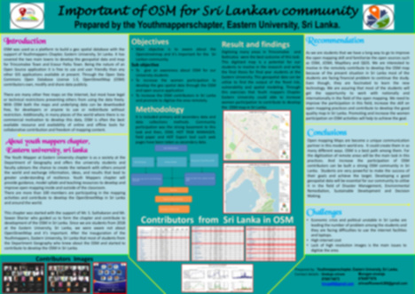](https://files.osmfoundation.org/s/QXi968oMooipPWX)

<h2 id="02">Crowd2Map</h2>

[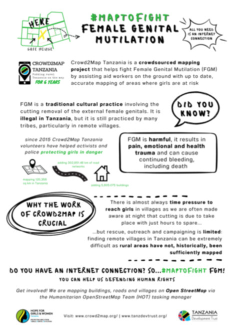](https://files.osmfoundation.org/s/fykAgNwr8tJpGyT)

<h2 id="03">OSM Monitoring Tool</h2>

[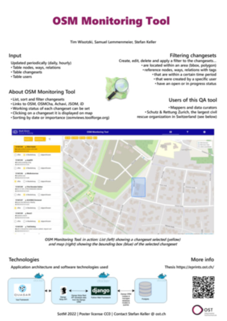](https://files.osmfoundation.org/s/LSnb3TqrH62zrHN)

<h2 id="04">Quality Check of the Links from OpenStreetMap to Wikidata</h2>

<h2 id="07">Quantifying Europe's cycling infrastructure using OpenStreetMap</h2>

<h2 id="09">Finding Grace - Mapping huts in Northern Uganda</h2>

[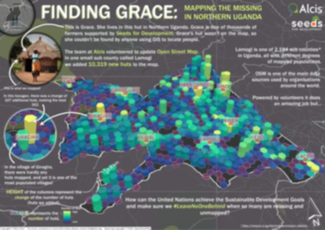](https://files.osmfoundation.org/s/xE5J45FjTrLN9if)

<h2 id="10">Using OSM for real-time crowdsourced air-quality monitoring</h2>

<h2 id="11">OpenSidewalkMap</h2>

[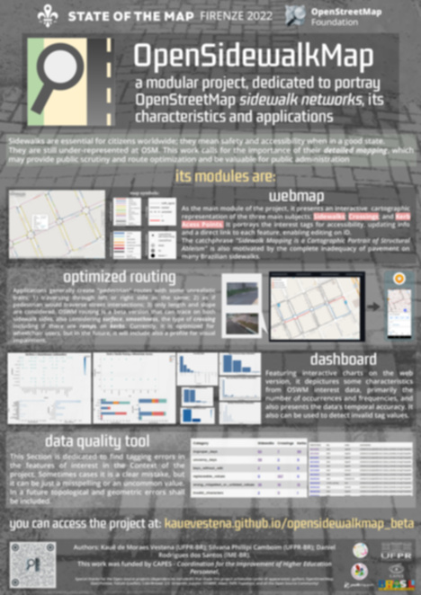](https://files.osmfoundation.org/s/RRk9zSzjkPxz7kM)

<h2 id="12">Mapping the Public Bus System of Minas Gerais, Brazil: Processing Difficult Datasets with OpenStreetMap</h2>

[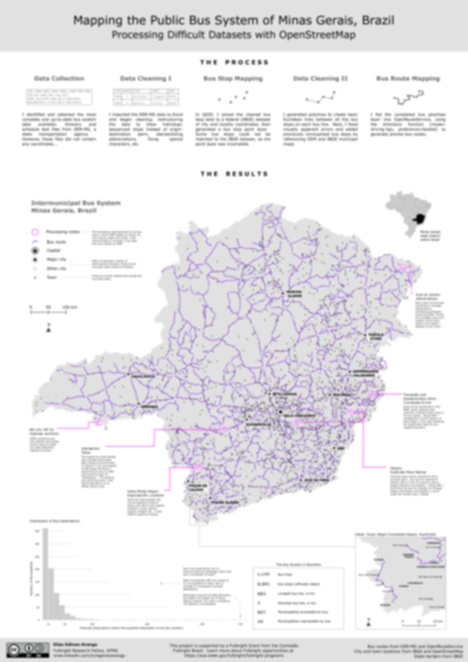](https://files.osmfoundation.org/s/YyBKYjKZGLTfKyK)

<h2 id="14">Mappers in Support of Peacekeeping</h2>

[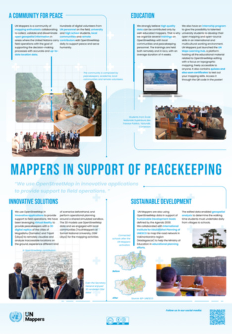](https://files.osmfoundation.org/s/qJKo5wwGjnywgys)

<h2 id="15">Land Cover Mapping in Africa</h2>

[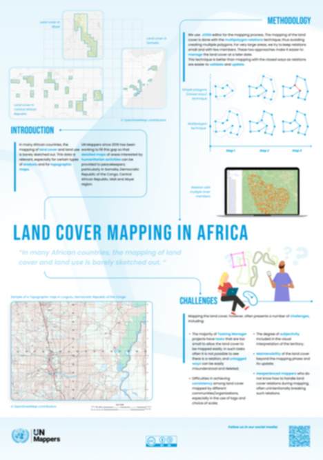](https://files.osmfoundation.org/s/HJkcS9atHReQTYL)

<h2 id="16">Change detection analysis using remote sensing and OSM: A case study of Beirut</h2>

[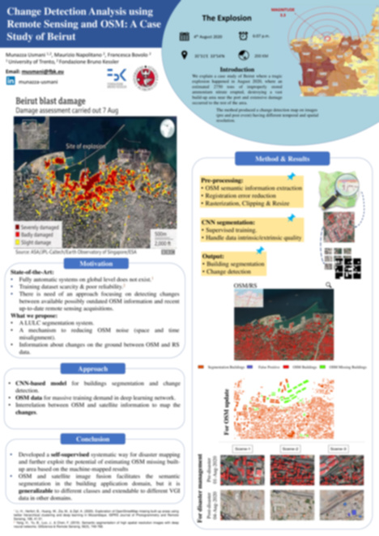](https://files.osmfoundation.org/s/qgHCPFBW8qc4rye)

<h2 id="17">Atlas Urbano Py: Urban characterization with OpenStreetMap and Mapillary</h2>

[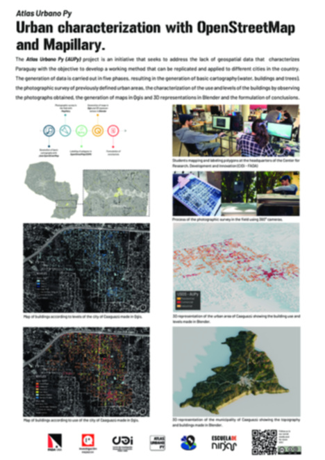](https://files.osmfoundation.org/s/8tTkS5ApQ3GPFj7)

<h2 id="18">Will this be updated? Rethinking OSM temporal quality beyond numbers</h2>

[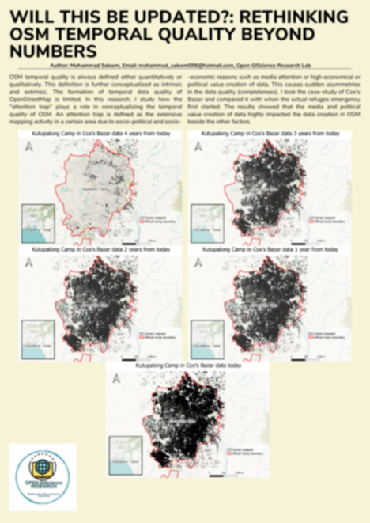](https://files.osmfoundation.org/s/wZ3sm9MHjNpMr33)

<h2 id="19">Contributor determinants affecting data quality in OpenStreetMap: A case study for European Railway Contributors</h2>

[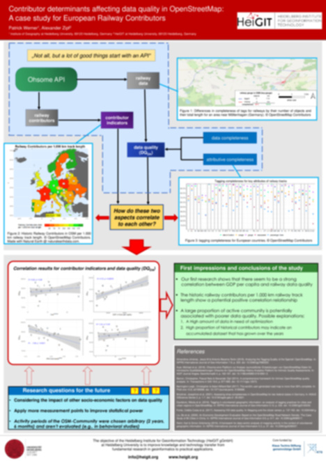](https://files.osmfoundation.org/s/tx6AgC8TNTydDLA)

<h2 id="20">Mapping on OpenStreetMap to improve access to health care in a rural district of Madagascar</h2>

[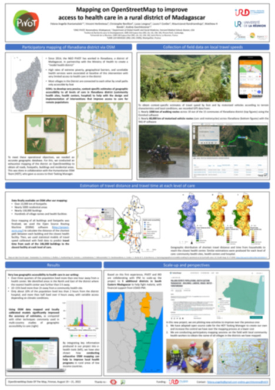](https://files.osmfoundation.org/s/kiZ6Q66cC574w6a)

<h2 id="22">Assessing households’ potable water access in Sibi in the Nkwanta North District - Ghana</h2>

[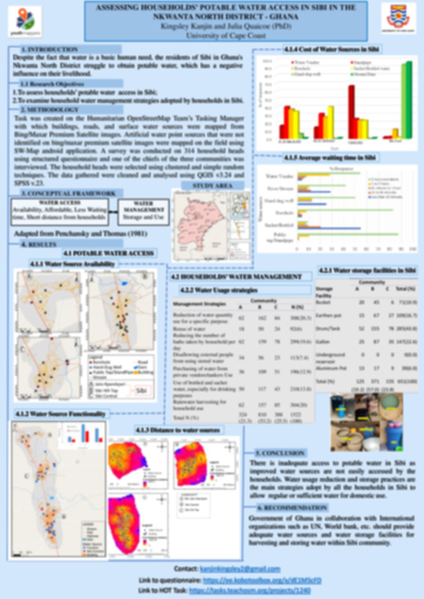](https://files.osmfoundation.org/s/36fDHTFmWs82yNJ)

<h2 id="23">Marinduque loop for bikers</h2>

[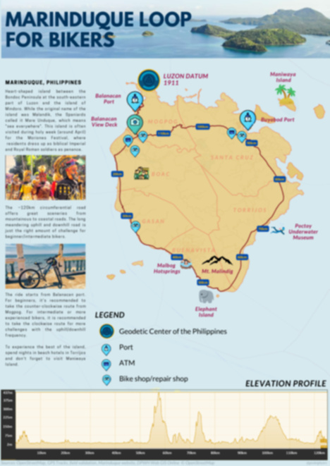](https://files.osmfoundation.org/s/ZngSfLFdBSiYQER)

<h2 id="24">Disaster Mapping Prioritization in OpenStreetMap</h2>

[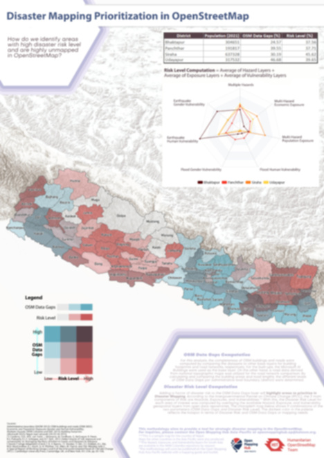](https://files.osmfoundation.org/s/eB7osW7aSTbNHAC)

<h2 id="25">Roma settlements mapping: Community Mapping in Eastern Slovakia</h2>

<h2 id="26">Access to safe abortion in Germany</h2>

[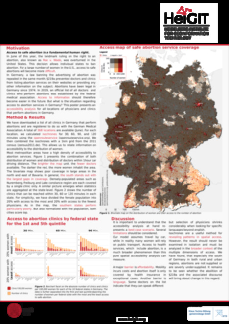](https://files.osmfoundation.org/s/MfweMaQyzaZiQ4p)

<h2 id="27">ArcGIS Renderer for OpenStreetMap</h2>

[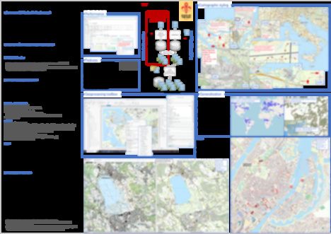](https://files.osmfoundation.org/s/xDdDz3rpQX2C7FJ)

<h2 id="28">Development of UNVT Portable, a map server with OpenStreetMap pre-installed using a RaspberryPi on a local network in offline situations during disasters</h2>

[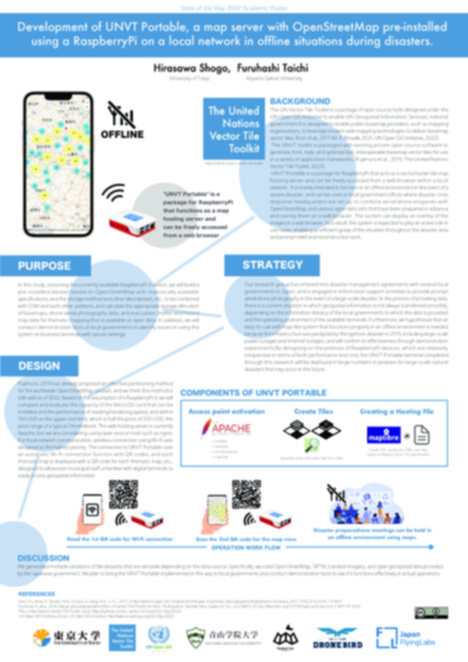](https://files.osmfoundation.org/s/JBQyGxzFXYZoxKQ)

<h2 id="29">Communities for Composting</h2>

[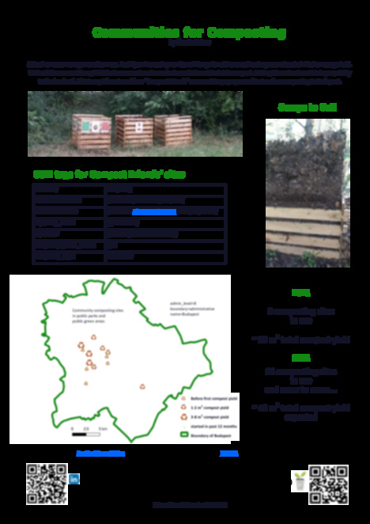](https://files.osmfoundation.org/s/NQtZpQgzfEa6ZPt)

<h2 id="30">Exploring Temporal Patterns of Mapper Retention in OpenStreetMap</h2>

[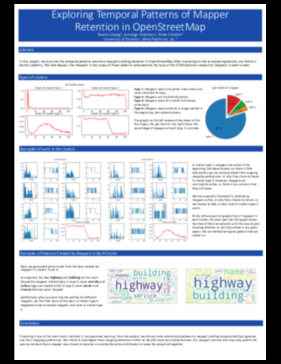](https://files.osmfoundation.org/s/Xp764cemTtfiPbk)

<h2 id="31">Using OpenStreetMap to Document Invasive Species Infestations</h2>

[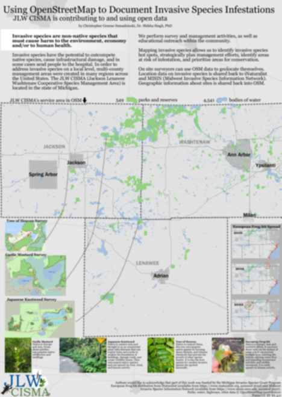](https://files.osmfoundation.org/s/gBK86MGXa35waZp)

<h2 id="32">Usage for Mapping the Historic Heritage of Cities</h2>

[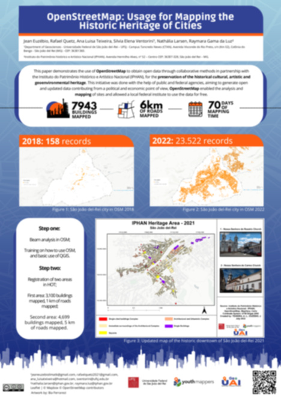](https://files.osmfoundation.org/s/nGzYbndrJ9W6meG)

<h2 id="33">Taking Care of Notes</h2>

[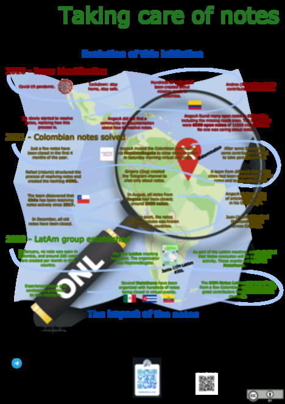](https://files.osmfoundation.org/s/cgiyMMB5qcmFwRT)

<h2 id="34">Mapeadores Livres UFPR</h2>

[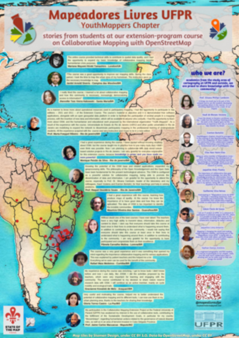](https://files.osmfoundation.org/s/QY9wnPjTcxsrXzB)

<h2 id="35">Rennes: The Great Fire of 1720</h2>

<h2 id="36">Mapping Stories and Memories as a Motivational Path in the Training of Vulnerable Communities Women Mappers</h2>

[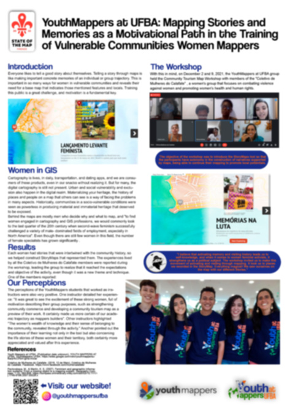](https://files.osmfoundation.org/s/P9qNZpXAW5LMBCJ)

<h2 id="38">Clear around Ukraine and Utilize support</h2>

[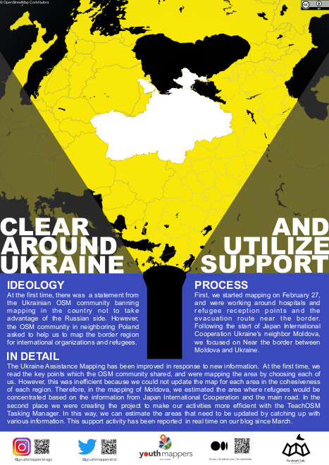](https://files.osmfoundation.org/s/tyHGTRwX2SdSFjM)
