

Many followed the call for posters and the results are AMAZING. We thank all
participants for the great work. If you would like to submit more, gladly
do, [info over here](/calls/posters)

*Please click on thumbnail to download PDF*

<h3 id="agu-japan">AGU Japan</h3>
In 2019, YouthMappers AGU was launched as local chapter in Japan. After that, we had collaborated with MSF Japan, MapSwipe, Missing Maps and local volunteered communities in Aoyama Gakuin University. 

<h3 id="fraxern-at">Fraxern, AT</h3>
Thomas Summer created a map of his village of 800 citizens which extends from 690m to 1000m in elevation. All entrances to the village are marked for a fast arrival of the local ambulance. The hydrants are highlighted for the fire station. Print outs were provided to both fire stations and ambulance.
[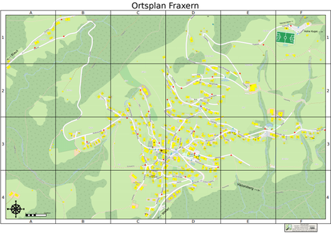](poster-ortsplan-fraxern.pdf) 

<h3 id="flagpoles">Flagpoles</h3>
Over 3,000 flagpoles in OpenStreetMap are tagged with Wikidata IDs indicating the specific flag design that flies on the flagpole. This chart shows a breakdown of the flags. Multiple flags on a flagpole are counted individually. 

[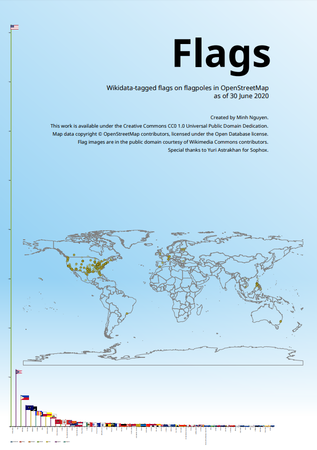](poster-flagpoles.pdf)

<h3 id="goat">GOAT</h3> GOAT stands for Geo Open Accessibility Tool and is designed to interactively model walking and cycling accessibility. The role of active mobility in urban planning is becoming more and more important – GOAT aims to provide elaborated decision support for planners to objectively plan more sustainable cities. The tool is under development at the Technical University of Munich. [Read more ...](poster-goat-description.pdf)

[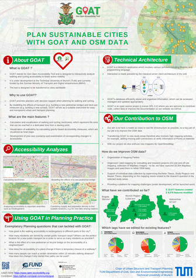](poster-goat.pdf) 

<h3 id="up-youthmappers">UP YouthMappers</h3>
University of Pretoria YouthMappers empowering South African youth through geospatial data.  

[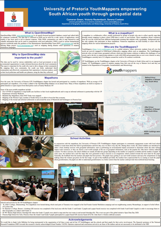](poster-tuks.pdf) 

<h3 id="ngong-kenya">Ngong, KE</h3>We  explored the potential use of OSM data to identify the buildings that were built on the riparian zone of Ngong river in Nairobi, Kenya. The southern part of Nairobi has recently been experiencing urban floods. Many researchers have linked the cause of floods to the encroachment of the riparian zone of river Ngong that passes through it. The encroachers developed structures ranging from semi permanent buildings to multistoried buildings which have since made the place vulnerable to flooding because  it interferes with the smooth flow of the surface runoff in the river channels.

[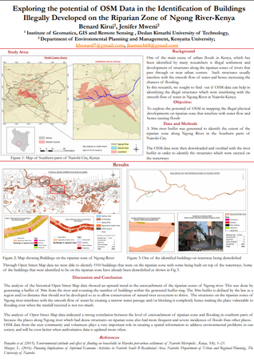](poster-ngong-river.pdf) 

<h3 id="tz">Education, TZ</h3>
Education is critical to poverty reduction and to improve education, initiatives usually start at school level. The analysis of school performance is a major concern for many governments around the world. Maps can be used to understand spatial relationships across areas and regions. Using these available maps from OpenStreetMap and the results from each school, school performance can be analysed in relation to spatial measures. The spatial measures include related data such as roads, rivers and economic centres. [Read more ...](poster-zanzibar)

[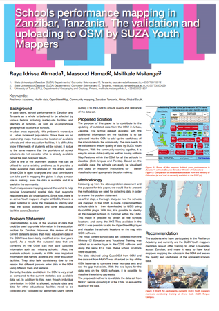](poster-zanzibar.pdf) 

<h3 id="mental-health">Mental Health</h3>
This poster shows how our volunteer organization — one of HOT OSM’s Micrograntees for this year — Mental Health AWHEREness, has been using maps and OSM data for community care in the Philippines, especially now during the COVID-19 pandemic. [Read more ...](poster-mentalhealth)

[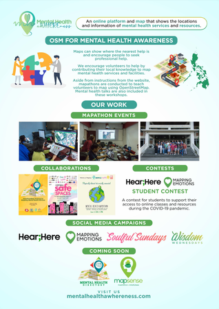](poster-mentalhealth.pdf)

<h3 id="colormap">ColorMap</h3>
ColorMap is a project born by desire to exploit the power of open geographic data for entertainment’s aims. Painting has the power of relaxing our mind, as the experts say, and the choice of colours allows us to externally release our emotions.
By © OpenStreetMap contributors data and GIS techniques has been possible to recreate maps to freely paint. By visiting the website [www.colormap.it](https://www.colormap.it), it is possible to request the area of  your heart place through a bounding box that you select on the webmap. After an offline OSM data processing by GIS techniques, a high resolution jpg will be created, ready to print and paint.

[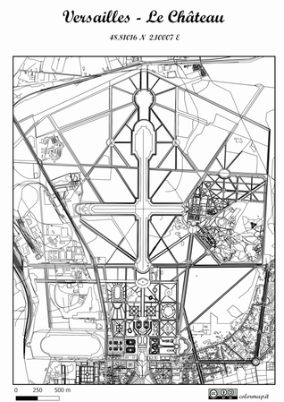](poster-colormap.pdf) 

<h3 id="cycle-routes">Cycle Routes</h3>
Among the actions implemented by the Sustainability Office of Politecnico di Milano, within the project Città Studi – Campus Sostenibile, the survey on the commuting habits of students and staff is the main source of data on mobility. Every two years, the whole population of the university (about 60.000 people in 7 campuses) is asked to describe their mobility pattern, contributing to the collection of useful data for planning and promoting sustainable mobility. The last questionnaire was administered in 2019 and reached a response rate close to 20%. [Read more](poster-openroute-description.pdf)

[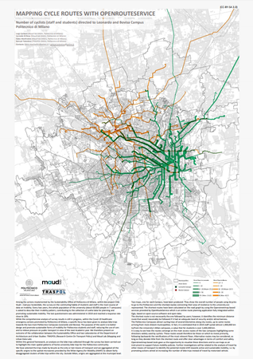](poster-openroute.pdf) 

<h3 id="netcreate">NetCreate</h3>
How OpenStreetMap data can help to provide sanitation to millions? 

[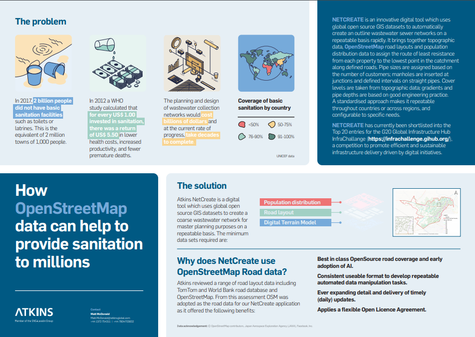](poster-netcreate.pdf) 

<h3 id="running">Running</h3>
As a running coach I'm constantly having to conduct assessments on the suitability of each route we use, to ensure that they are safe, appropriate, convenient etc... and almost all of the data I use for those assessments is contained only in my mind. This poster demonstrates just some of the points of information I use, that could, also, be recorded in OpenStreetMap. In addition to showing how that particular data might be useful, it might also inspire other mappers to think about what data they subconsciously process everyday that might find some value within OpensStreetMap.

[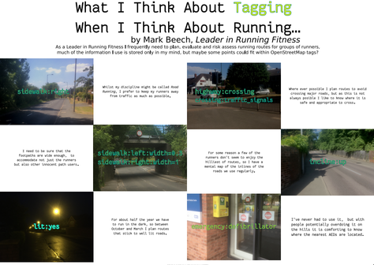](poster-running.pdf) 

<h3 id="nis">Niš, RS</h3>
We used OSM data to detect best tourist (sub)zones in the city Niš (Serbia). We have tourist attractions such as monuments, sacral objects, ambient whole, buildings,archaeological sites,fortress as well as restaurants and accommodations. Also, the important factor for the evaluation is street network for determining density and distance for emblematic area (most visited tourist area in Niš). Based on these elements, the area study was conducted.

[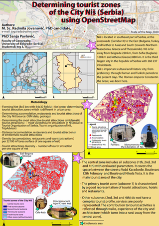](poster-nis-serbia.pdf) 

<h3 id="kathmandu">Kathmandu, NP</h3>
Tourism supports economic sector of developing country like Nepal which provides concrete and quantitative growing in trading opportunities and it can be supported by interactive tourism mapping that will provides a way to support decision making for tourists. In this study open street data are used for showing six layers that includes cultural, natural, road, hospital, hotel, bank from open street map. Natural feature layer includes parks, water bodies, forests, protected area. Cultural-site layer includes durbar, temples, stupa, church, museum, palace. Hospital layer includes all clinic, local health post, hospital. Hotel layer includes all hotel, guest house, restaurant, lodges, party palace. Bank layer includes banks branch and ATM locations. Such types of applications such as inventory, analysis and evaluation of plan based on tourism development.
 
[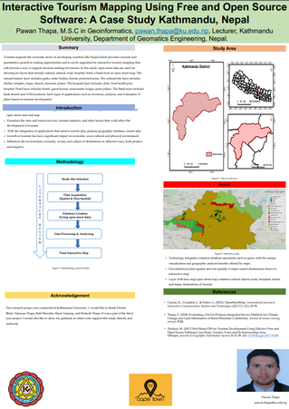](poster-kathmandu.pdf)

<h3 id="water">European Water</h3>
European Water Project works to convince individuals to use water bottles that can be refilled in a sustainable way and avoid creating single-use plastic. European Water Project has created a Web App available in 8 languages which lets people find the nearest drinkable water fountain or “refill” café to refill their reusable water bottle. We embrace Open Data principles to meet these non-commercial objectives. All European Water Project Drinking Fountain and Refill café locations are stored in the OpenStreetMap and Wikidata databases. Fountain and café imagery is served from Wikimedia Commons, Mapillary, and the European Water Project server.

[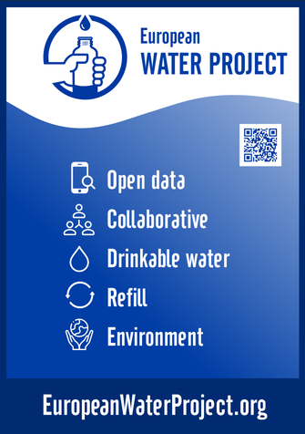](poster-water.pdf)

<h3 id="un-mappers">UN Mappers</h3>
Unite Maps Initiative formerly named United Nations Dynamic TLM (Topographic
Line Map) Production, is a mapping initiative to collaborate in peacekeeping,
peacebuilding and conflict prevention activities. United Nations helps countries
torn by conflict create conditions for lasting peace through the Department of
Peacekeeping Operations (DPKO). [Read more...](poster-unmappers)

[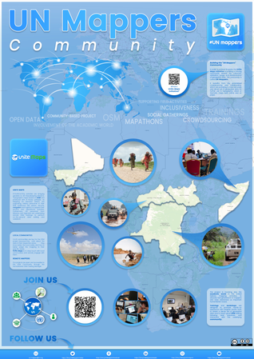](poster-unmappers.pdf)

<h3 id="hotph">HOT, PH</h3>
In partnership with the UP Resilience Institute (UPRI), the Humanitarian OpenStreetMap Team (HOT) - Philippines has completely mapped and validated building footprints in Quezon City, Metro Manila on OpenStreetMap as part of the response we are doing to end COVID-19 (#endcov). Quezon City is one of the most densely populated and hardest hit municipalities in the Philippines by COVID-19. The OSM building footprints were used by UPRI to develop a data-driven analysis and recommendation to the local government unit of Quezon City for the city's pandemic response. This is also part of the [PhilAWARE](https://www.hotosm.org/projects/data-driven-disaster-risk-management-philaware/) project to map the critical infrastructures across the Philippines. The mapping initiative started on April 20, 2020 through the HOT's Tasking Manager ([#8385](https://tasks.hotosm.org/projects/8385), [#8386](https://tasks.hotosm.org/projects/8386)). Through the help of 644 contributors around the world, 317,325 building footprints were added and validated to OSM in 62 days.

We would like to take this opportunity to thank our amazing mappers, validators, and volunteers who tirelessly work on creating and maintaining the data quality in OSM that would surely help the local communities in our campaign to #endcov.

[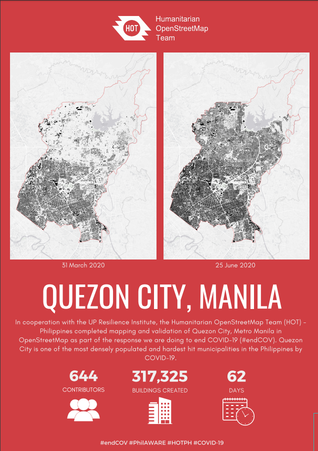](poster-hotph.pdf)
