

Many followed the call for posters and the results are AMAZING. We thank all participants for the great work! Some more information can be found on our [call for posters](/calls/posters) page.

*Please click on thumbnail to download PDF*

<h3 id="01">Important of OSM for Sri Lankan community</h3>

[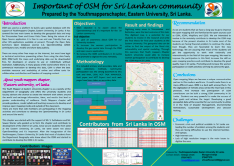](https://files.osmfoundation.org/s/QXi968oMooipPWX)

<h3 id="02">Crowd2Map</h3>

[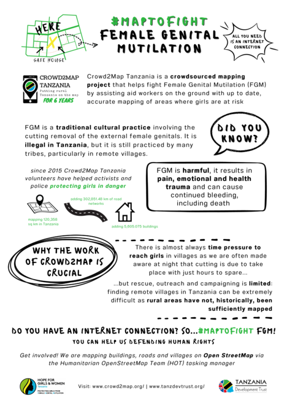](https://files.osmfoundation.org/s/fykAgNwr8tJpGyT)

<h3 id="03">OSM Monitoring Tool</h3>

[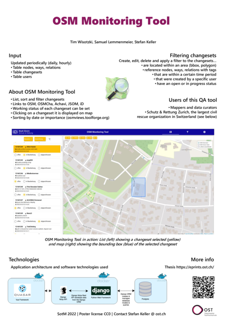](https://files.osmfoundation.org/s/LSnb3TqrH62zrHN)

<h3 id="04">Quality Check of the Links from OpenStreetMap to Wikidata</h3>

[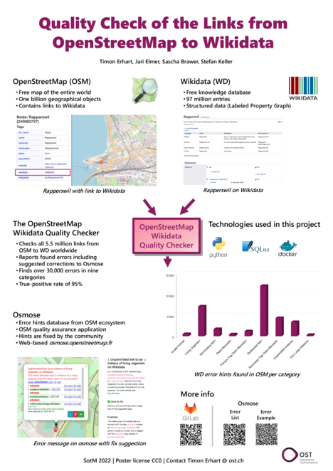](https://files.osmfoundation.org/s/CMPYdRKmbDxBkrn)

<h3 id="07">Quantifying Europe's cycling infrastructure using OpenStreetMap</h3>

[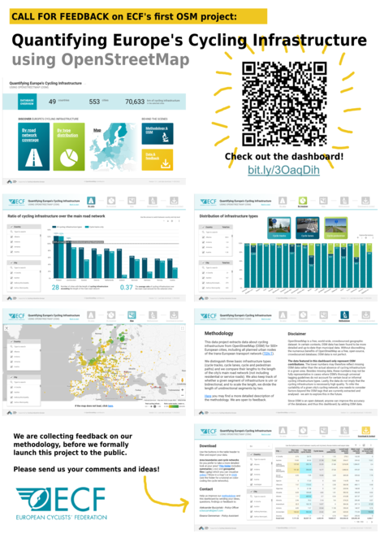](https://files.osmfoundation.org/s/aDcLGHjtqP8PcJ5)

<h3 id="09">Finding Grace - Mapping huts in Northern Uganda</h3>

[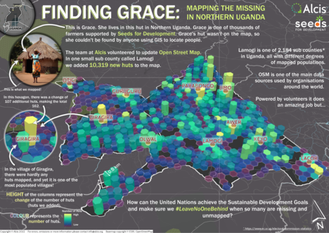](https://files.osmfoundation.org/s/xE5J45FjTrLN9if)

<h3 id="10">Using OSM for real-time crowdsourced air-quality monitoring</h3>

[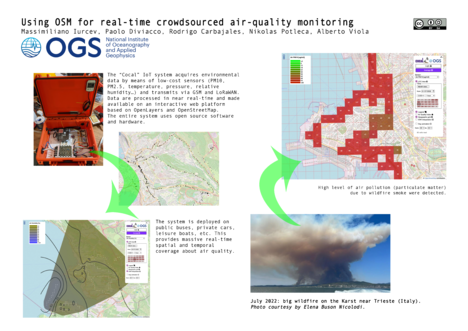](https://files.osmfoundation.org/s/TwsSq9kdEZ4EH2k)

<h3 id="11">OpenSidewalkMap</h3>

[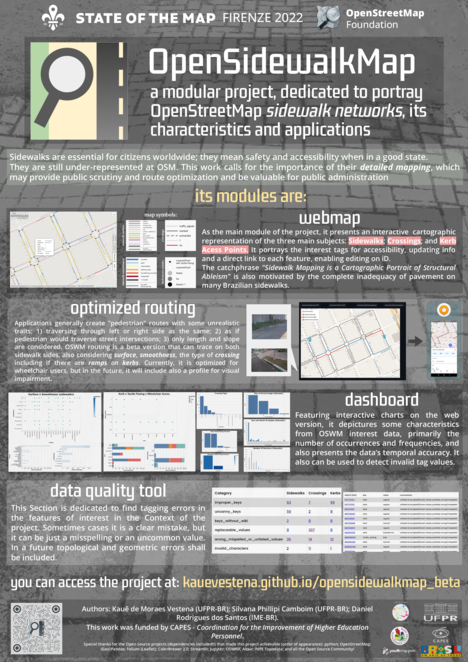](https://files.osmfoundation.org/s/RRk9zSzjkPxz7kM)

<h3 id="12">Mapping the Public Bus System of Minas Gerais, Brazil: Processing Difficult Datasets with OpenStreetMap</h3>

[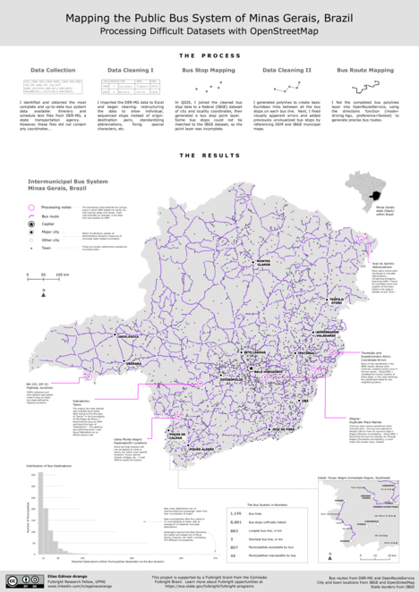](https://files.osmfoundation.org/s/YyBKYjKZGLTfKyK)

<h3 id="14">Mappers in Support of Peacekeeping</h3>

<h3 id="15">Land Cover Mapping in Africa</h3>

<h3 id="16">Change detection analysis using remote sensing and OSM: A case study of Beirut</h3>

[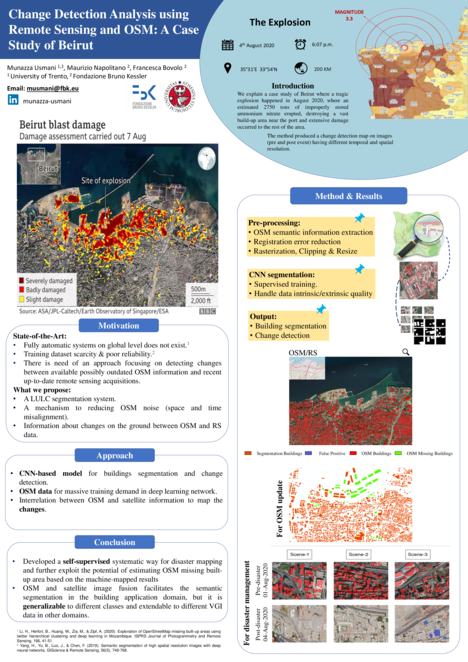](https://files.osmfoundation.org/s/qgHCPFBW8qc4rye)

<h3 id="17">Atlas Urbano Py: Urban characterization with OpenStreetMap and Mapillary</h3>

[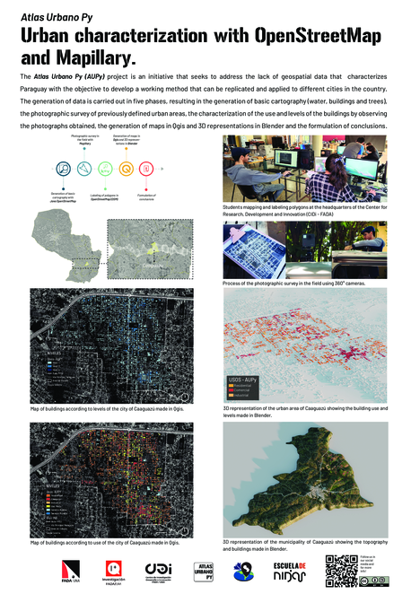](https://files.osmfoundation.org/s/8tTkS5ApQ3GPFj7)

<h3 id="18">Will this be updated? Rethinking OSM temporal quality beyond numbers</h3>

[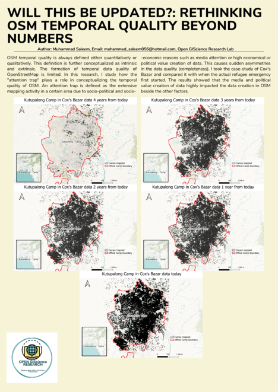](https://files.osmfoundation.org/s/wZ3sm9MHjNpMr33)

<h3 id="19">Contributor determinants affecting data quality in OpenStreetMap: A case study for European Railway Contributors</h3>

<h3 id="20">Mapping on OpenStreetMap to improve access to health care in a rural district of Madagascar</h3>

<h3 id="22">Assessing households’ potable water access in Sibi in the Nkwanta North District - Ghana</h3>

[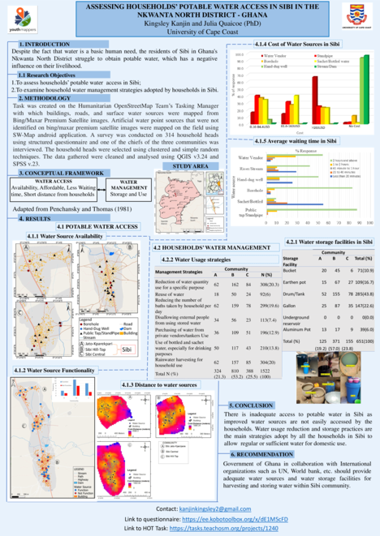](https://files.osmfoundation.org/s/36fDHTFmWs82yNJ)

<h3 id="23">Marinduque loop for bikers</h3>

[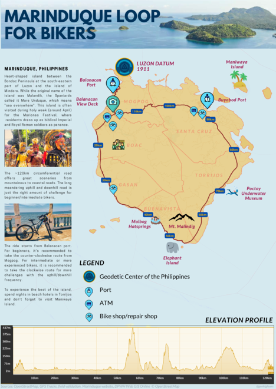](https://files.osmfoundation.org/s/ZngSfLFdBSiYQER)

<h3 id="24">Disaster Mapping Prioritization in OpenStreetMap</h3>

[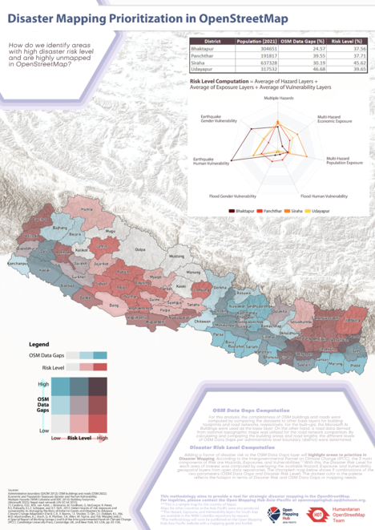](https://files.osmfoundation.org/s/eB7osW7aSTbNHAC)

<h3 id="25">Roma settlements mapping: Community Mapping in Eastern Slovakia</h3>

[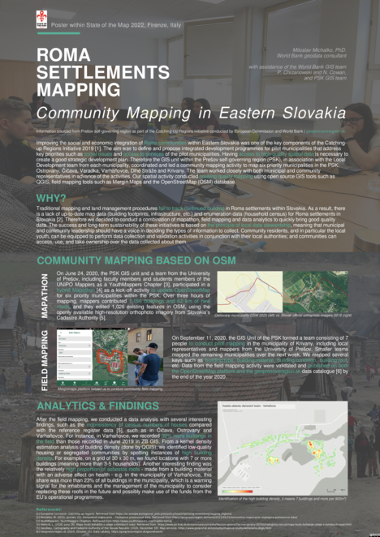](https://files.osmfoundation.org/s/iQpLxK4d6EADDYA)

<h3 id="26">Access to safe abortion in Germany</h3>

[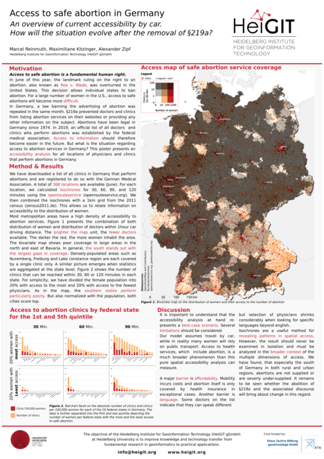](https://files.osmfoundation.org/s/MfweMaQyzaZiQ4p)

<h3 id="27">ArcGIS Renderer for OpenStreetMap</h3>

<h3 id="28">Development of UNVT Portable, a map server with OpenStreetMap pre-installed using a RaspberryPi on a local network in offline situations during disasters</h3>

<h3 id="29">Communities for Composting</h3>

[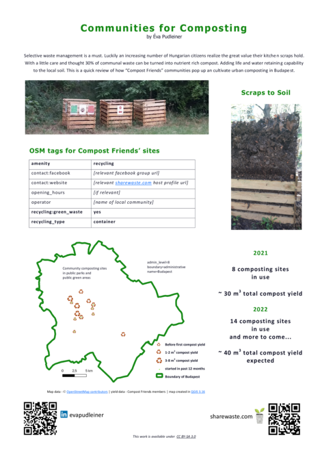](https://files.osmfoundation.org/s/NQtZpQgzfEa6ZPt)

<h3 id="30">Exploring Temporal Patterns of Mapper Retention in OpenStreetMap</h3>

[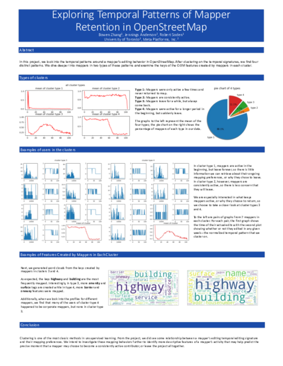](https://files.osmfoundation.org/s/Xp764cemTtfiPbk)

<h3 id="31">Using OpenStreetMap to Document Invasive Species Infestations</h3>

[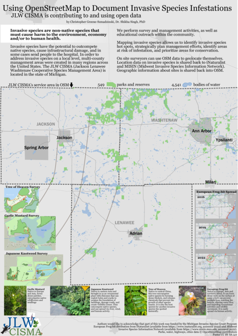](https://files.osmfoundation.org/s/gBK86MGXa35waZp)

<h3 id="32">Usage for Mapping the Historic Heritage of Cities</h3>

[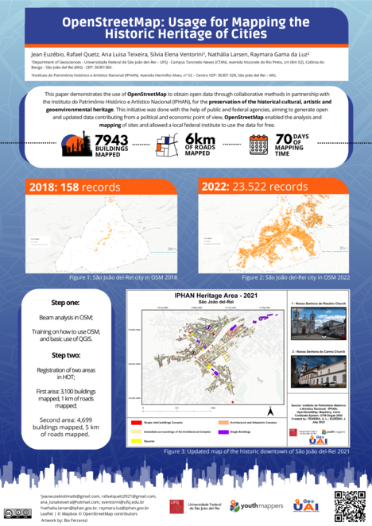](https://files.osmfoundation.org/s/nGzYbndrJ9W6meG)

<h3 id="33">Taking Care of Notes</h3>

<h3 id="34">Mapeadores Livres UFPR</h3>

[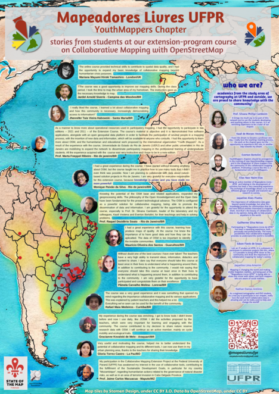](https://files.osmfoundation.org/s/QY9wnPjTcxsrXzB)

<h3 id="35">Rennes: The Great Fire of 1720</h3>

[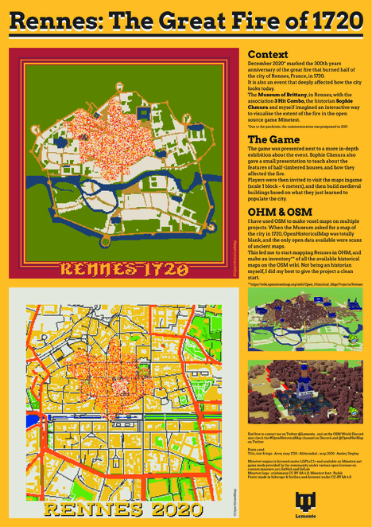](https://files.osmfoundation.org/s/Ra2JHAJED7m96az)

<h3 id="36">Mapping Stories and Memories as a Motivational Path in the Training of Vulnerable Communities Women Mappers</h3>

