

Many followed the call for posters and the results are AMAZING. We thank all
participants for the great work. If you would like to submit more, gladly
do, [info over here](/calls/posters)

*Please click on thumbnail to download PDF*

<h3 id="tauscher">Helga Tauscher: "Let's meet at an island!"</h3>

Let's meet at an island!

The project has started out as an attempt to create a meeting place for friends and family during the COVID-19 pandemic. A handmade map of our favourite island, Rügen in the Baltic Sea, served as a world for WorkAdventure - an adhoc video-conferencing system or spatial chat tool, where participants navigate their avatars through a retro gaming environment and establish Jitsi meetings once they approach each other.

Being an artist, software developer and researcher in the area of construction informatics, building and city modelling as well as geospatial information, this initial gimmick led to a deeper investigation of how to populate such worlds for spatial chat tools with real-world data, ideally open data, on an automated basis. The island scenario is one of three scenarios we are investigating in our lab, with the other two being scenarios on the building and city district level

More information, code, test maps, project updates: https://hlg.github.io/wamap

Contact: Helga Tauscher, HTW Dresden - University of Applied Sciences

* WorkAdventure: https://workadventu.re
* Project on Github: https://hlg.github.io/wamap
* Contact: https://www.htw-dresden.de/en/hochschule/fakultaeten/geoinformation/ueber-uns/personen/translate-to-english-dr-ing-helga-tauscher

[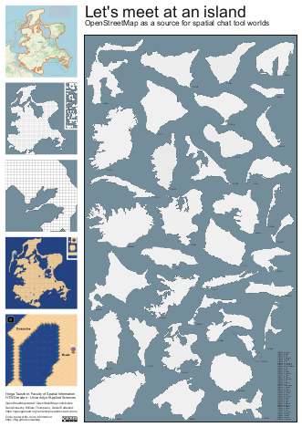](https://files.osmfoundation.org/s/A637eGiCjHa3eMq)

<h3 id="pudleiner">Éva Pudleiner: "Equine Tooth Fairy visits"</h3>

Inspiration

Equine Tooth Fairies actually exist. They come in all different shapes and forms, use their “magic wand” to balance horses’ continuously growing teeth. Asymmetrical erosion can cause tiny injuries in the mouth even leading to major health breakdowns when ignored.

Therefore it is more than smart to have our equine specialist veterinarian check our four-legged friend’s mouth time to time and perform a basic balance dental care.

Horses are herd animals, they need space and often times their homes are in remote areas. Although, it is still much more cost effective to move around a person and equipment in a van to these remote areas, I wondered what I can do to make this activity energy efficient.

Organising appointments

As a GIS professional and a horse owner I am grateful to have partnered with Dr. Katalin Tornyi’s integrative praxis where we started to implement my proposal of spatially managing her clients all over Hungary.

Based on her thorough documentation of 2019-2020’s visits I created a map of mostly manually edited locations. Then, a colour coded, ordered offline visit plan was made to help manage balance dental appointments for 2021. Previously these appointments were exclusively initiated by horse owner clients.

This visit plan (not shown in the poster) is a tool for proactive appointment generation and also to keep in touch with clients who have difficulties arranging vet checks.

Starting 2021Q1 I also prepare quarterly analysis on the distribution of balance visits, implementing some custom KPI-s of the individual praxis. The primary goal is to support Katalin in organising her versatile work efficiently by using and reflecting on the original boundary and initial conditions she set up.

Tag-talk

Seven highlighted OSM tags represent practical information that I would propose to be used by mappers in Hungary for the benefit of equine professionals and horse owners.

Map

For the first time I used openrouteservice API that turned out to be a great tool to create reachability zones for categorising destinations.

Hereby I express my special thanks to Adam Rousell for his insights and help in the creation of this poster which would not be here without the support and encouragement from our community of OpenStreetMap Hungary.

[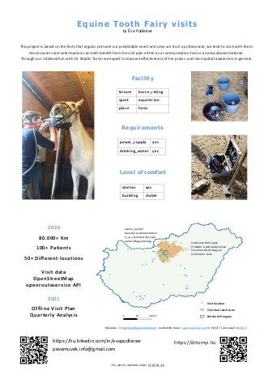](https://files.osmfoundation.org/s/cPKF7yZj2zkxyyB)

<h3 id="nguyen">Minh Nguyen: "Mapping POIs in Santa Clara County, California (Silicon Valley)"</h3>

I’ve uploaded a poster to Nextcloud named “Mapping POIs in Santa Clara County”. The full title is “Mapping points of interest in Santa Clara County, California (Silicon Valley)”. The poster has plenty of context; all I’d add is the following:

Join one of the largest POI imports in OpenStreetMap history and help us achieve complete coverage. Help us show that volunteers can make a better map than proprietary automated methods! https://maproulette.org/browse/projects/42122

My OSM user name is Minh Nguyen.

[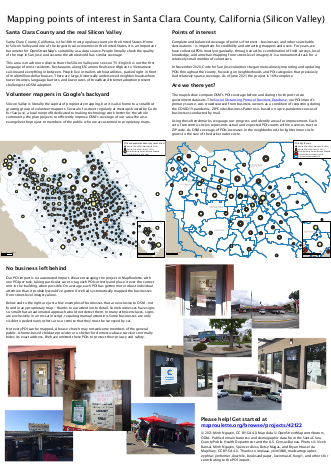](https://files.osmfoundation.org/s/CkGg3peXFTHPqXo)

<h3 id="openmapchile">Equipo OpenMapChile SPA: OpenMapChileSoftMap2021</h3>

Urban trees are one of the main strategic resources for global warming mitigation. The management of any resource begins with a diagnosis of the resource. Urban tree planning is no exception. It is proposed that inventories are essential to provide a current record of the resource to be managed.

The objective is to propose a methodology that allows a "preliminary survey of the Public Urban Tree Inventory of any city in Chile", moving from a current situation to a future one through the use of open source tools available in the open and collaborative mapping platform OpenStreetMap. org (OSM) platform; in turn, collaborating on a global open data platform, which allows the management and interoperability of a large amount of geospatial data for the construction and scalable development of a Virtual Public Urban Mapping (VUPM) system, in the long term. Today, OSM is more than a multi-vendor map: it is becoming a global mapping standard.

The data registration was done virtually by interpreting mainly Bing satellite imagery, provided by OSM's default editor, known as iD and based on the web browser. The iD tool is easy and fast to use, and allows mapping from different data sources such as satellite and aerial imagery (Esri World Imagery, DigitalGlobe, Mapbox), GPS, Field Papers or Mapillary. Recognising the patterns and texture that indicate trees, a vector element of type node (point) is assigned to its geographical location, and labels are associated to its attributes. In this case, the attributes (10) for the tree object entered are the following:

addr:city
addr:street (street name)
denotation (avenue, street, garden)
genus (genus)
leaf_cycle (evergreen, deciduous)
leaf_type (broadleaved, needleleaved, palm)
natural (tree)
species (scientific name)
species:es (common name)
species:mp (mapudungún name)

A large percentage of the tree species were identified using the Google Street View street visualisation tool, taking into account the year in which they were updated. Considering that trees are static elements of the city's infrastructure that remain over time, it is possible in many cases to present a high degree of certainty in the correct identification.  However, we are aware that the identification has to be done on the ground, which has an associated cost that our organisation is not able to finance at the moment.  It has been voluntary work without monetary compensation.

[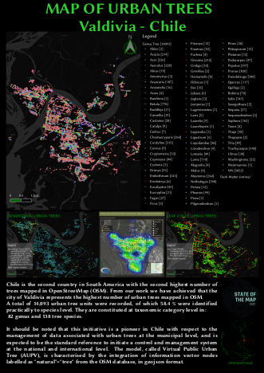](https://files.osmfoundation.org/s/RbRaodxgtW4jpw9)

<!--
<h3 id="gomez">Andres Gomez: "Mapping Bogota, Colombia in detail"</h3>

This poster describes the activities around Bogota (what we have done since last year-2020 and what we are currently doing). Our purpose is to improve the quality of the data of the capital of Colombia, and at the same time to build a stronger community committed with the map. Until now, we have done these activities like armchair mapping and virtual meetings, all from home, to prevent in-person meetings due to Covid-19.

[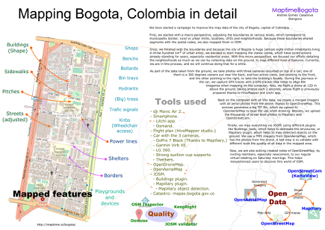](https://files.osmfoundation.org/s/fCGi4aLgPEqAZN9)
-->

<h3 id="sahoo">Shreeparna Sahoo: "Accessibility to Hospitals Providing Covid Treatment Using OpenStreetMap"</h3>

Poster titled 'Accessibility to Hospitals Providing Covid Treatment Using OpenStreetMap' which explains accessibility to the hospital whether the covid treatment facility is available or not. In the fight against the current COVID tsunami that’s engulfing us, we, along with a group of amazing volunteers (most of them being young college students and young working professionals), have been trying to respond to SOS tweets and alerts coming in from various parts of the country but still  people are struggling to find the hospitals which provide the covid treatment provision. So adding on to that it will show in the description whether the facility is available or not. And also tags are being added which will make the search more convenient.

[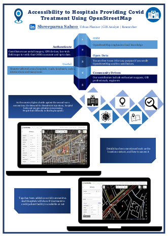](https://files.osmfoundation.org/s/TWA8awGz9SRoKRi)

<h3 id="kaldyrkaev">Sergey Kaldyrkaev "Penza mapping party 2021 poster"</h3>

Cold Russian winters are not a reason to pause map contributions! In our Penza OSM community, we decided to improve the city’s building coverage and organised an online mapping party that lasted for nearly six weeks. The results have exceeded everyone’s expectations, and we are happy to share them with the world.

[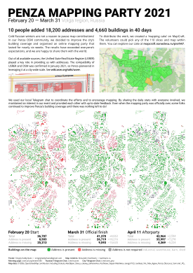](https://files.osmfoundation.org/s/FcQbFLEfdi7FxEZ)

<h3 id="huang">Grant Huang: "OSM 15min cities"</h3>

The project is a derivative from my Transportation planning course presentation to find out the urban space that has a better walking environment. We are using both data from The OSM and Kaohsiung City Government.
“15 minute cities” is a new concept that the basic needs are within 15 minutes travel time. The concept had gone rival since the pandemic lockdown.
We could assess the places by using open data to calculate the coverage of the service.
To find out whether all kinds of service are in 15 minutes on foot. There are four kinds of service: Traffic, Medical, Educational, Commercial. All represent in respective colors.
Since the open data is not extensive in most Taiwanese Cities. The OSM plays an important role in providing basic information like roads and MRT stations.
We are using Kaohsiung as an example for the project since the city is recently focusing on green transportation policy. The area within the white area means the basic service is within walkable distance.
Thanks to OSM I can finish my presentation, and find out the walkability of Kaohsiung.

[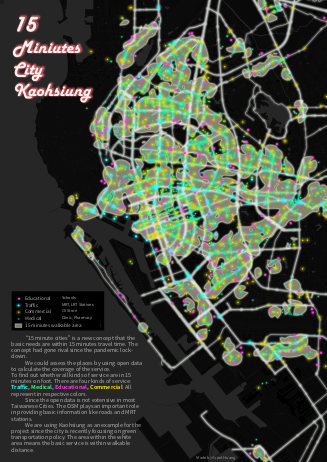](https://files.osmfoundation.org/s/ESGMM2qiaSbErDF)

<h3 id="staniek">Michael Staniek: "Overpass NL"</h3>

OverpassNL is a complex dataset pairing geographical queries to OpenStreetMap (OSM) using the Overpass API with their corresponding natural language counterparts. It is based on nearly 10,000 queries in the Overpass query language that have been issued by Overpass users and saved in Overpass Turbo. The goal of this dataset is to train models that access OSM with natural language questions (semantic parsing), and to generate natural language for existing Overpass queries (interpretation).

[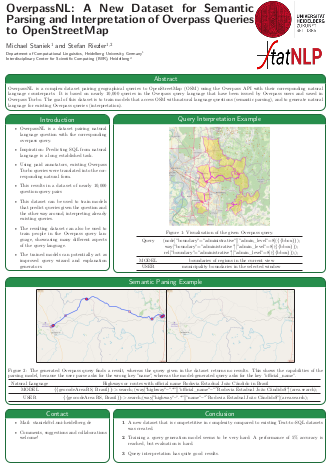](https://files.osmfoundation.org/s/czYxbX8xQXjYLDo)

<h3 id="polimappers">PoliMappers Team: "PoliMappers Poster"</h3>

In 2021 PoliMappers included in their annual activities the innovative teaching course entitled “Collaborative and Humanitarian Mapping”, pursuing the objective to build a responsible student-led community of OSM contributors and Free and Open Source Software (FOSS) users. The programme is structured into seven meetings and aims to introduce university students to the OSM environment, focusing on the potential of its open data and its related geospatial tools, especially in the humanitarian field. The course, officially recognized by the university as an open participation teaching activity, recorded the participation of 61 Politecnico di Milano students. However, the series of webinars and workshops has been conceived as open and freely accessible for interested people from other institutions, with the attendance of different groups of the YouthMappers global network. PoliMappers curated the course programme, choosing the contents, preparing the material of the webinars, and defining the contexts for collaborations with other associations and groups at both the national and international level. Indeed, the course has seen the participation and support of the World Food Programme (WFP), Open Knowledge Foundation, TECHO Colombia, IMM Design Lab, Map for Future, UN Mappers, Spazio Vita Niguarda Onlus, Ledha Milano, AUS Niguarda Onlus and Humanitarian OpenStreetMap Team (HOT).

[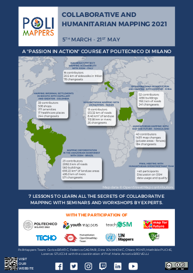](https://files.osmfoundation.org/s/tpoQSSajzzbLnnb)

<h3 id="saleem">Muhammad Saleem: "Rethinking temporal-spatial data quality aspects for OpenStreetMap"</h3>

Goal of this work is to redefine the temporal quality dimension for OSM, which will facilitate the practical implications in measuring spatial data quality of OSM intrinsically when the external high-quality data is scarce. There are several factors that make our world temporally sensitive.
These factors are governed by change agents. The most prominent change agents are stressors such as disasters or conflict. Data is usually produced with high speed during such extreme events. It also includes new housing plans, population growth (very prominent in slums), policy shifts and urban transformations etc,. The data in the global south is usually not updated during these events and can cause data in OpenStreetMap to stale .i.e low temporal quality and constitute as incomplete.

<h3 id="lohr">Sarah Lohr: "Mapathon experiment"</h3>

Humanitarian organizations are interested in building up a community of voluntary mappers, either for preventive action or in order to quickly respond to humanitarian disasters. However, Hristova et al. (2013) have shown that mapathons largely fail on engaging new-comers on the long-
run. Therefore, we developed a new mapathon concept to increase user retention rates among remote mapathon new-comers.

Based on a literature review, we identified event- and participant-related variables which we expect to have an effect on long-term mapping activities. Using questionnaires for organizers and participants, we compare conventional mapathons with this newly developed concept. If your organization wants to participate, either by testing our new concept, or by handing out questionnaires to participants of conventional mapathons, please contact sarah.lohr@heigit.org.

[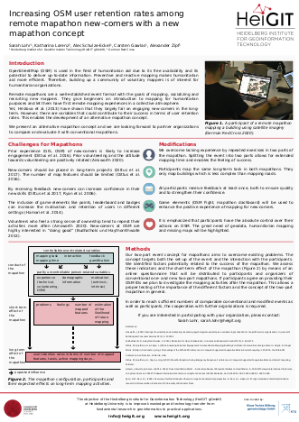](https://files.osmfoundation.org/s/yQyfa6CFBXLsMfe)

<h3 id="takahashi">Ayako Takahashi, YouthMappers AGU, Aoyama Gakuin University, Japan</h3>

This poster shows what we have done in the past one year.
We joined some mappathon and worked on mapping promotion activities.
In April, we welcomed 5 new members and now we have 12members in total which made it possible to plan and carry on some new activities such as holding mapping workshops for students and starting our own YouTube channel.
Please stay tuned for this year's activities of YouthMappers AGU!

[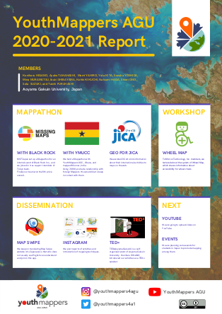](https://files.osmfoundation.org/s/aLYF3oTiG5rLmBQ)

<h3 id="schüssler">Janina Schüssler: "Heigit Healthcare Poster"</h3>

HeiGIT is working with OpenStreetMap (OSM) data in a variety of ways for several years now. An emerging topic is OSM data for healthcare applications. The Corona pandemic is an omnipresent example of how important availability and transparency of data on healthcare capacity is. For example, by knowing the number, location and equipment of health facilities can provide potentially life-saving information and assist in decision-making and planning. This poster looks at the health facility data currently available in OpenStreetMap. The main focus is on the progression over the last years, the current distribution globally and the thematic structure.

[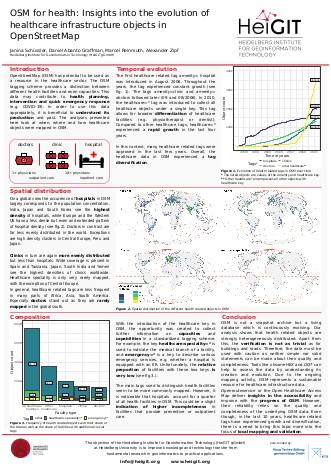](https://files.osmfoundation.org/s/tLqd7rqgnAMELMn)

<h3 id="vesanto">Heikki Vesanto: "OSM Ireland Buildings"</h3>

OpenStreetMap Ireland Buildings is a project aiming to map all of the buildings in Ireland. The project launched in January 2020. The mapping is being coordinated with a tasking manager at tasks.OpenStreetMap.ie

We invite anyone to contribute to the project. If you participate we will also send you a sticker for free, just map a tile and apply for a sticker at www.OpenStreetMap.ie/stickers/

The project was supported by a microgrant from the OSMF in September 2020.

The project also includes improving the tagging of buildings. With an initial goal of increasing the granularity from a simple building = yes.

1,666,328 buildings have been mapped so far, with 701,678 added since the start of the project, with an additional 120,356 edited.

<h3 id="üstün">Yusuf Mert Üstün: "Batumi Land-use Development Project"</h3>

Batumi Land-use Development Project" is a personal map detailing the project. And it aims to transfer the land use dynamics of the Georgian city of Batumi on the Black Sea to OpenStreetMap. Thus, much more detailed inferences can be made about the city, which is very important for the analysis of sciences such as geography and city planning. That's why, in this personal project, I'm adding piece-by-piece land use information to the city of Batumi.

<!--
<h3 id="eguren">Lucas Eguren: "PFI Argentina"</h3>

The Argentine Republic has 158 international border crossings, which are the entry and exit points for people, goods and means of transportation, linking it directly (by river or land means) with its five neighboring countries: Bolivia, Brazil, Chile, Paraguay and Uruguay. Fourteen of them are administered by the Ministry of the Interior, while the remaining 144 are under the orbit of the Ministry of Security, whose control is delegated to the National Gendarmerie and the Argentine Naval Prefecture.

[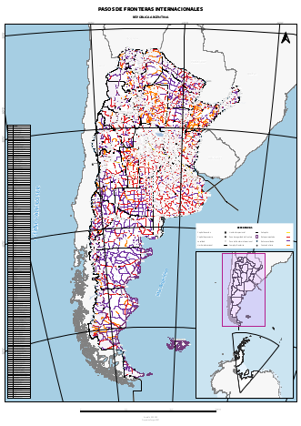](https://files.osmfoundation.org/s/MEdixbPkJTrNJsn)
-->

<h3 id="schumann">Raphael Schumann: "Natural Language Processing and OpenStreetMap"</h3>

The poster presents a project at the intersection of Natural Language Processing and OpenStreetMap. OSM is used to render small routes within New York City and paid annotators are asked to write natural language navigation instructions that use landmarks instead of distances and street names. A machine learning model is then trained on this data in order to automatically generate navigation instructions that resemble the style of those human written instructions.

[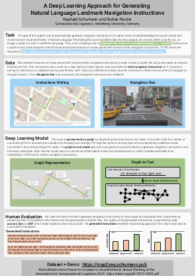](https://files.osmfoundation.org/s/q7xM6qzKHDmWqd6)

<h3 id="vlasak">Jiri Vlasak: "Divide and map."</h3>

Divide and map. Now. -- the damn project -- helps mappers by dividing
some big area into smaller squares that a human can map.

Two years ago, I decided to prove there could be a better solution to
the problem of dividing a big area into smaller squares.

Main points of the damn project philosophy are:

* Simplicity and openness.
* Performance and decentralization.
* Reliability and scalability.

[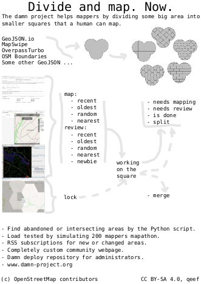](https://files.osmfoundation.org/s/8pDFaEdzaCLKEta)
